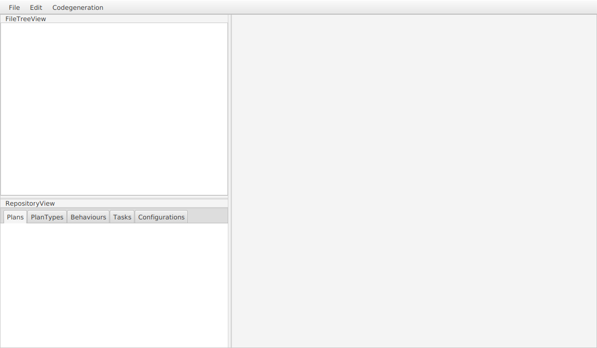
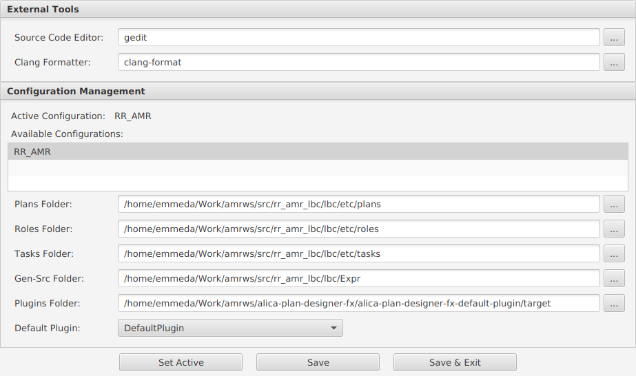
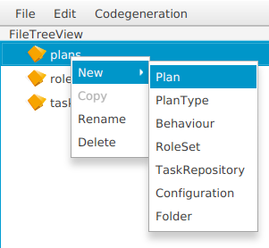
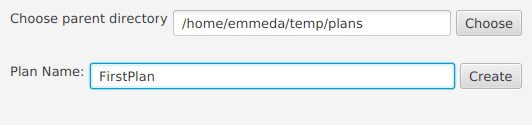

# Quickstart Guide

In this Quickstart Guide, we will show you how you setup an empty and unconfigured Plan Designer, so that you can start modelling plans right away. So let's start...

When you start the Plan Designer the first time, its main window should look like this:

## Configure the Plan Designer

1. Open the *Edit* menu from the top menu bar and choose *Configure* in order to open the Configuration window:
2. Fill out the fields one after another.
   1. **Source Code Editor:** The Plan Designer supports to open auto generated code from within the Plan Designer. For this it will open the editor you will enter in this field, parametrised with the path to the respective auto generated file. At the moment, probably only "gedit" will work.
   2. **Clang Formatter:** Just enter "clang-format". Nothing else is supported at the moment.
   3. **Available Configurations:** As no configuration is available, yet, you need to create one by double clicking on the first empty line under *Available Configurations* and enter a name for your configuration, e.g. RR_AMR. Press *Enter* to confirm your entry.
   4. **Plans Folder:** Enter the path to your projects plan-folder.
   5. **Roles Folder:** Enter the path to your projects roles-folder.
   6. **Tasks Folder:** Enter the path to your projects tasks-folder.
   7. **Gen-Src Folder:** Enter the path to the folder, where you want the Plan Designer to generate its source code into.
   8. **Plugins Folder:** Enter the path to folder with the code generation plugins, you want to use. Most likely choose the path that includes the JAR of the Default Plugin module.
   9. **Default Plugin:** Choose the code generation plugin, that should be configured as default plugin from the drop down menu. If nothing shows up, the configured *Plugins Folder* does not contain a code generation plugin.
3. Save the configuration and set it active. If something goes wrong at this point, you probably have made a mistake in the last step.

## Create a First Plan

1. Create your first plan by right-clicking on the *plans* folder and choosing New->Plan from the context menu and choosing a proper name in the next pop-up window:

     

2. Open your first plan via a double-click on it in the *RepositoryView*.

Now you are ready to model your first plan. The tools for this are located in the tools pallet on the right of the plan tab you just opened. Information about what ever element you select in the plan tab, will show up in the section below the plan tab. For more explanation on how to use the Plan Designer, please consider the rest of this user guide. And now have fun modelling your first plan ...

